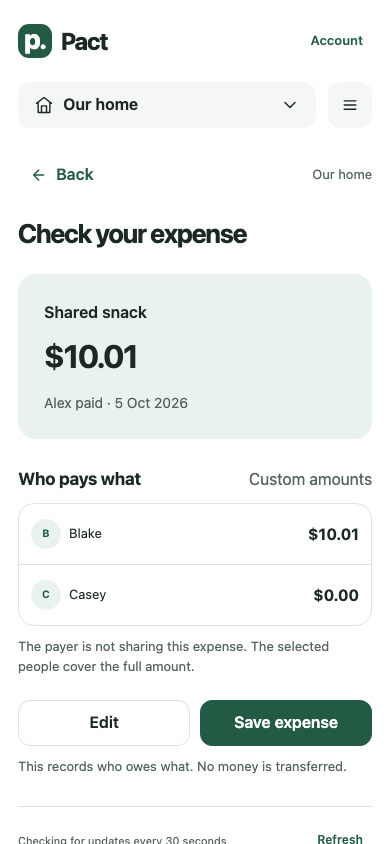
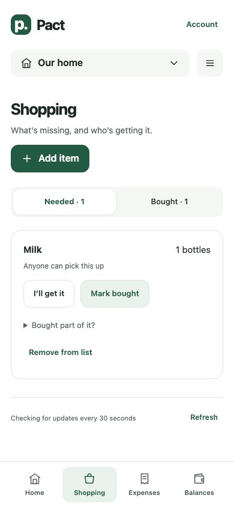
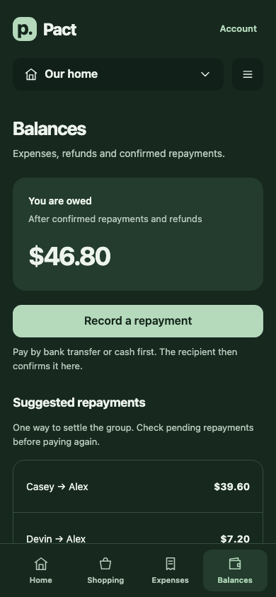

# Pact

**Shared expenses, shopping and trips — built for the everyday reality of living together.**

Pact started as a fun personal project to solve a problem I encountered while living in a shared house: keeping track of shared spending and the things we needed to buy. A purchase might involve everyone, only a few people, or someone paying on another person's behalf. Shopping and occasional trips added another layer to keep organised.

The idea is simple: one place to record what happened, choose who shares the cost, and see what needs doing next.

Built with **React, TypeScript, Vite and Supabase**. Designed for phones, with light and dark themes and a home-screen web app icon.

This branch prepares the [profile and appearance preview](docs/RELEASE-0.4-PREVIEW.md). It is not a deployed release, and the separate 0.3.1 auto-fill update still needs to be reviewed and integrated.

## What it does

- **Shared expenses:** choose the payer and participants, split equally or by exact amounts, and review before saving.
- **Balances and repayments:** see who owes what; repayments affect balances when the recipient confirms them.
- **Shopping:** add quantities, claim an item, record partial purchases, and turn a purchase into an expense.
- **Trips:** include only the people going and keep trip costs separate from the household.
- **Household access:** Google sign-in, personal invitations, member management and an activity history.
- **Corrections and exports:** retain the original expense when correcting it, record refunds, and export the group ledger.

Pact records repayments; it does not transfer money.

## A look inside

Fictional people and example transactions, generated by the local tests. Select a preview to see the full screen.

<table>
  <thead>
    <tr>
      <th width="33%" align="center" scope="col">Review expenses</th>
      <th width="33%" align="center" scope="col">Shared shopping</th>
      <th width="33%" align="center" scope="col">Track balances</th>
    </tr>
  </thead>
  <tbody>
    <tr>
      <td align="center" valign="top">
        <a href="docs/images/expense-review.png"></a>
      </td>
      <td align="center" valign="top">
        <a href="docs/images/shopping-needed.png"></a>
      </td>
      <td align="center" valign="top">
        <a href="docs/images/balances-dark.png"></a>
      </td>
    </tr>
    <tr>
      <td align="center">Check the split before saving.</td>
      <td align="center">See what needs buying.</td>
      <td align="center">Know who owes what.</td>
    </tr>
  </tbody>
</table>

## Run locally

Use Node.js **22.12 or later** (`.nvmrc` selects Node 22).

```sh
git clone https://github.com/erankawinda/pact.git
cd pact
npm ci
cp .env.example .env.local
```

Create your own development Supabase project, apply the migrations in order, and configure Google sign-in using the [setup guide](docs/GOOGLE-SETUP.md). Put that project's URL and publishable key in `.env.local`, then run:

```sh
npm run dev -- --host localhost
```

The app runs at `http://localhost:5173`. Without a configured backend it shows a setup message. The automated tests below work independently of a hosted project.

Only a **publishable** Supabase key belongs in the browser. Database passwords, service-role keys and OAuth client secrets must never be placed in frontend files.

## Verify changes

```sh
npm run check
npx playwright install chromium
npm run test:browser
```

`check` runs the Node tests, TypeScript checks and production build. Database tests apply the actual SQL migrations to disposable PGlite databases. Browser tests use fictional accounts, intercept external traffic, and run accessibility checks with axe. No production credentials are needed.

GitHub Actions runs both suites on pushes and pull requests. See [QA instructions](qa/README.md) for the coverage and its limits.

## How it fits together

```text
src/                    React screens, navigation, sync and money helpers
public/                 App icons, web manifest and hosting headers
supabase/migrations/    Versioned schema, access rules and database operations
tests/                  Money, workflow, database and interaction tests
qa/                     Isolated browser test harness
docs/                   Architecture, setup, deployment, status and roadmap
.github/workflows/      Automated verification
```

Amounts are stored as integer cents. Household access is enforced in the database, and retried writes carry request IDs to avoid recording the same operation twice. More detail is in the [architecture guide](docs/ARCHITECTURE.md).

## Current stage

**Version 0.3 — a working personal project under household testing.** The core workflows are implemented. Real two-phone sync, concurrent database sessions and device accessibility still need broader validation. The app currently uses AUD and Melbourne time.

Receipt attachments, recurring bills, monthly reports and full backup restoration are not implemented. JSON export is a group snapshot, not a complete restorable backup. See the [status](docs/STATUS.md) and [roadmap](docs/ROADMAP.md).

## Working on Pact

Keep changes focused and test them in a separate development household. [CONTRIBUTING.md](CONTRIBUTING.md) explains the commit structure and checks; [deployment](docs/DEPLOYMENT.md) covers publishing without replacing existing user data.

This repository contains project source and synthetic examples only. Real household records, contact details, invitation links, production configuration and data exports are excluded. See [SECURITY.md](SECURITY.md) before reporting a problem.
