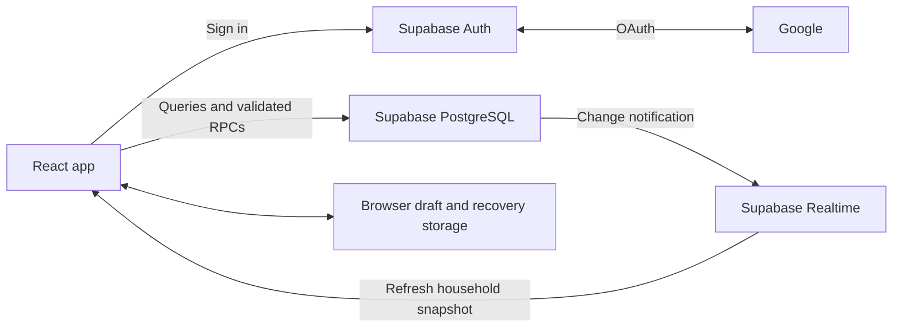

# Architecture

Pact keeps the interface in a static React application and the shared records and permissions in PostgreSQL. There is no separate application server in this repository.

## Source map

| Area | Responsibility |
|---|---|
| `src/App.tsx`, `src/navigation.ts` | Session state, screens and browser history |
| `src/api.ts`, `src/useHousehold.ts` | Supabase connection, snapshots, refresh and Realtime subscriptions |
| `src/AccountProfile.tsx`, `src/profile.ts` | Own display name, account details and device appearance preference |
| `src/ExpenseForm.tsx`, `src/money.ts` | Expense entry, whole-cent parsing and equal/exact splits |
| `src/pendingExpense.ts`, `src/useMutation.ts` | Store a request before sending; retry the same operation after an uncertain response |
| `src/Shopping.tsx`, `src/HouseholdViews.tsx` | Shared shopping, expense history, balances and repayments |
| `src/Management.tsx`, `src/GroupForms.tsx`, `src/invitations.ts` | Households, trips, invitations and member administration |
| `src/export.ts` | CSV and JSON group exports |
| `supabase/migrations/` | Schema, row-level access rules, RPCs and financial invariants |
| `tests/`, `qa/` | Unit/database tests and isolated browser scenarios |

## Shared data and access

A group is either a household or a trip under a household. Membership records carry an organiser/member role and active/revoked status. Trip membership is limited to selected household members; household access also gates linked trip access.

Google identities create profile records. Personal invitation tokens are stored as hashes and tied to an intended email address, with expiry and revocation. A signed-in user must accept a matching invitation before joining.

An own-name update RPC derives its target from the verified session, never a supplied user ID. Profile names remain visible to authorised co-members; private account emails and appearance choices are not added to shared profile rows. Names can change in history displays, while ledger references keep their immutable user IDs. Appearance is stored on the device and can follow the operating system.

Readable tables use row-level security. Clients cannot write financial and workflow tables directly; public RPC wrappers call private functions that check identity, membership, role and input before a transaction commits. The database, rather than hidden buttons, enforces permission decisions.

## Money and history

Amounts use integer cents. Equal splits distribute leftover cents deterministically; exact splits must sum to the total. The current product uses AUD and Melbourne dates.

Custom splits keep manual values separate from calculated shares. One unknown share receives the remainder; several unknown shares require the explicit equal-remainder choice. An entered zero is fixed, while a blank is unknown. Review freezes the resulting integer shares, so interrupted saves retry the same request rather than recalculating against a newer draft.

Balances are derived from posted expenses and shares, refunds and confirmed repayments. Recording a pending repayment does not change balances. Corrections retain the voided original and create a replacement expense; refunds are bounded by the refundable amount. Activity records make changes inspectable.

Request IDs and stored operation results let supported mutations reconcile a retry without applying the same request twice. Version checks detect edits based on stale state. Local tests exercise these rules, but they do not certify races across independent PostgreSQL connections.

## Synchronisation and browser storage

Realtime notifications trigger a fresh household snapshot. The app also refreshes on focus, visibility changes, reconnect and every 30 seconds while visible and online. The database remains authoritative; the client does not merge an offline ledger.

Expense drafts and pending operations use browser local storage, scoped to the user and group. Invitation and sign-in return state use session storage. Losing browser data can lose an unfinished draft or recovery request, so storage is not a backup. A network timeout does not prove a write failed; use the existing recovery action before entering the same expense again.

## Hosting and scope

Vite emits static files for hosting. The manifest and icons support a Home Screen shortcut with standalone presentation. There is no service worker or offline transaction queue in this version.

Only a Supabase URL and publishable key belong in the frontend build. Google secrets and privileged Supabase keys stay outside it. The checked-in headers assume hosted `*.supabase.co` endpoints.

JSON export is a group snapshot, not a restorable database/Auth/Storage backup. Receipt attachments, reports and other deferred features are tracked in [ROADMAP.md](ROADMAP.md).
